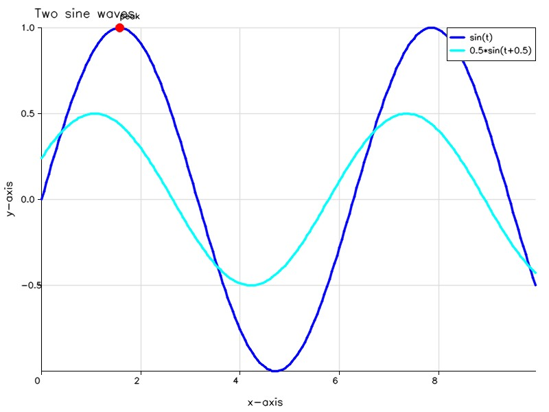
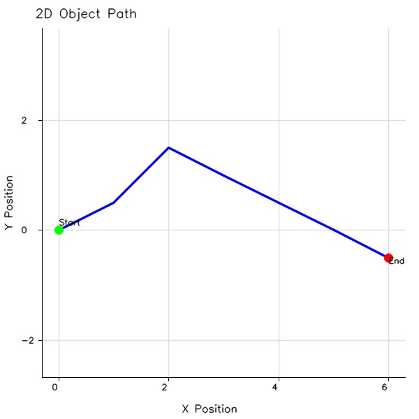
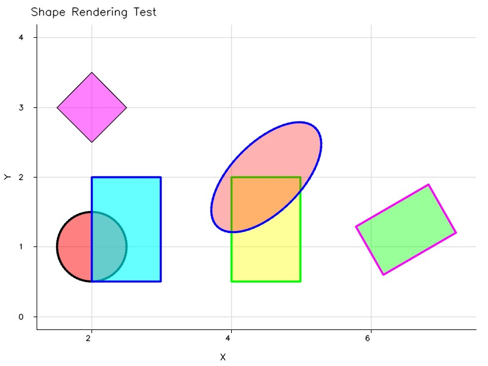

# MatPlotOpenCV

[](https://opensource.org/licenses/BSD-3-Clause)

MatPlotOpenCV is a small C++17 plotting library built on OpenCV 4. It supports
lines, scatter plots, text, basic shapes, axes, grids, labels, and legends.
Figures can be displayed in an OpenCV window or saved as images.

The project is developed and tested on Windows. Its CMake build also supports
Linux through standard OpenCV package discovery, but Linux has not yet been
tested as part of this release-readiness work.

## Example plots

### Two sine waves



### 2-D path



### Shapes



## Quick start

```cpp
#include "figure.h"

using namespace mpocv;

Figure figure(640, 480);
figure.plot(x, y, Color::Blue(), 2.0f, "signal");
figure.scatter(px, py, Color::Red(), 5.0f, "events");
figure.text(3.14, 1.0, "Peak");
figure.grid(true);
figure.legend();
figure.title("Demo");
figure.xlabel("Time [s]");
figure.ylabel("Amplitude");
figure.save("demo.png");
figure.show();
```

## Requirements

- CMake 3.16 or newer
- A C++17 compiler
- OpenCV 4.5 or newer with `core`, `highgui`, `imgproc`, and `imgcodecs`
- Doxygen when building the optional API documentation target

## Build on Windows

The default Windows OpenCV location is configured in
`cmake\local_paths.cmake`. It currently expects:

```text
C:\opencv\build\x64\vc16\lib
```

From PowerShell in the repository root:

```powershell
cmake -S . -B build
cmake --build build --config Release
```

Run the demo with:

```powershell
.\build\Release\matplotopencv_demo.exe
```

Run the automated tests with:

```powershell
ctest --test-dir build -C Release --output-on-failure
```

If OpenCV is installed elsewhere, override the cached path without editing the
project files:

```powershell
cmake -S . -B build -DMATPLOTOPENCV_OPENCV_DIR="C:/path/to/opencv/cmake"
```

The value must name the directory containing `OpenCVConfig.cmake`. Forward
slashes are intentional in CMake values; Windows path separators are used for
PowerShell executable paths.

## Build on Linux

Install OpenCV and make its CMake package discoverable, then run:

```bash
cmake -S . -B build -DCMAKE_BUILD_TYPE=Release
cmake --build build
./build/matplotopencv_demo
```

Run the automated tests with:

```bash
ctest --test-dir build --output-on-failure
```

The Windows-only local path file is not loaded on Linux. If OpenCV is installed
in a nonstandard location, provide its package directory explicitly:

```bash
cmake -S . -B build -DCMAKE_BUILD_TYPE=Release \
  -DOpenCV_DIR=/path/to/opencv/cmake
```

## Build options

- `MATPLOTOPENCV_BUILD_DEMO=ON|OFF`
- `MATPLOTOPENCV_BUILD_DOCS=ON|OFF`

The demo defaults to `ON` when building MatPlotOpenCV directly and `OFF` when
it is included by another CMake project. Documentation defaults to `OFF` in
both cases so Doxygen is not required for a normal build.

To enable and generate API documentation:

```powershell
cmake -S . -B build -DMATPLOTOPENCV_BUILD_DOCS=ON
cmake --build build --config Release --target doc
```

## Repository layout

```text
MatPlotOpenCV/
|-- CMakeLists.txt
|-- cmake/
|-- demo/
|-- docs/
|-- images/
|-- include/
|-- src/
`-- tests/
```

The `matplotopencv_tests` executable provides automated regression coverage.
The demo remains the manual visual-validation program.

## Limitations

- OpenCV Hershey fonts do not support rich text or LaTeX.
- Vector output, subplots, interactive zoom, and interactive pan are not
  implemented by this library.
- Concurrent access to one `Figure` is not safe. HighGUI may also require calls
  from the application's UI thread, depending on the OpenCV backend.
- Coordinate vectors passed to `plot()` and `scatter()` must have matching
  lengths; mismatched vectors throw `std::invalid_argument`. `polygon()`
  currently ignores empty or mismatched coordinate vectors.
- Circles, rotated rectangles, and rotated ellipses represent their documented
  data-space geometry accurately when equal scaling is enabled. With unequal
  x- and y-axis scales, their screen-space rendering is not an exact affine
  transform of the data-space shape.
- Legend swatches for labeled shapes currently use the default command color
  instead of the shape's configured line or fill color.
- Tick labels use one decimal place for intervals below one, so very small
  ranges can display repeated labels.
- Line thickness, marker size, text scale, text thickness, and `ShapeStyle`
  numeric values are not fully validated before being passed to OpenCV. Use
  positive, finite sizes and scales, and keep fill alpha in the range `[0, 1]`.

## License

MatPlotOpenCV is licensed under the [BSD 3-Clause License](LICENSE).
